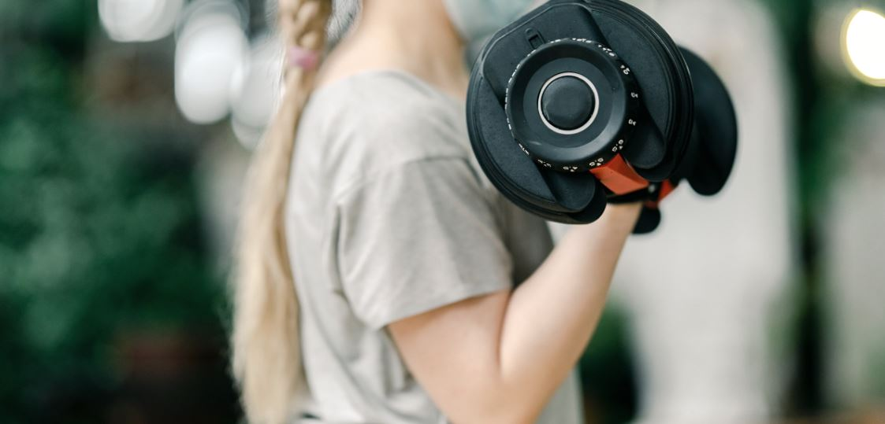

# Gimnasio Vuelta de Tuerca 🏋️‍♀️

Este proyecto es una página estática desarrollada como parte de un curso de maquetación. El objetivo fue aplicar conocimientos fundamentales de HTML y CSS, incluyendo:

- Diseño responsive con **Flexbox** y **CSS Grid**
- Uso de **tipografías personalizadas** y de Google Fonts
- Maquetación semántica y buenas prácticas
- Inclusión de imágenes y estilos adaptables
- Efectos visuales como hover, sombra, opacidad y contador automático

## ✨ Tecnologías

- HTML5
- CSS3
- Fuentes personalizadas (tipografía Bodoni)
- Google Fonts (`Poppins`)
- Media Queries para responsive design

## 📸 Captura de pantalla

## 📁 Estructura de carpetas

